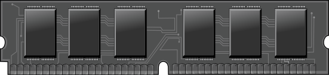
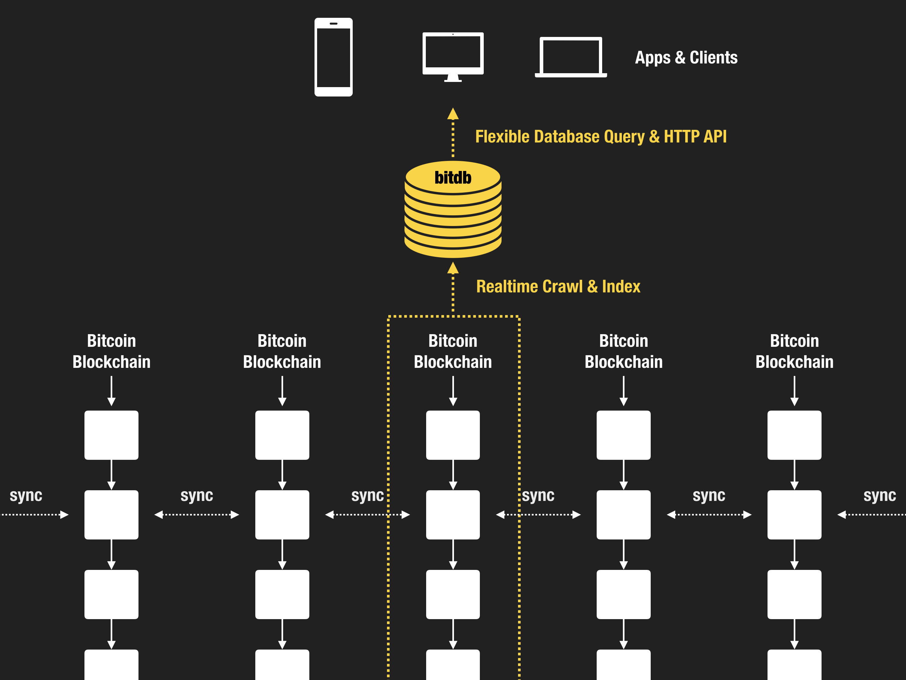
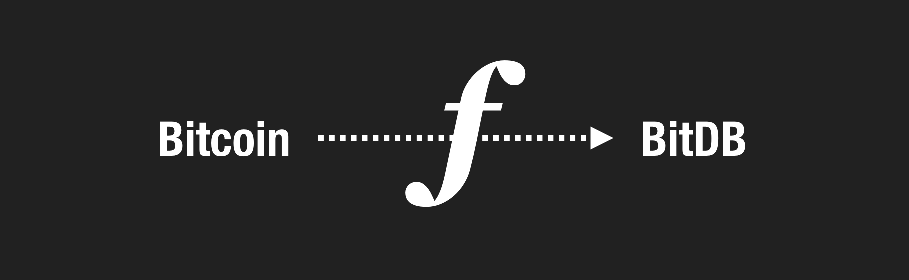
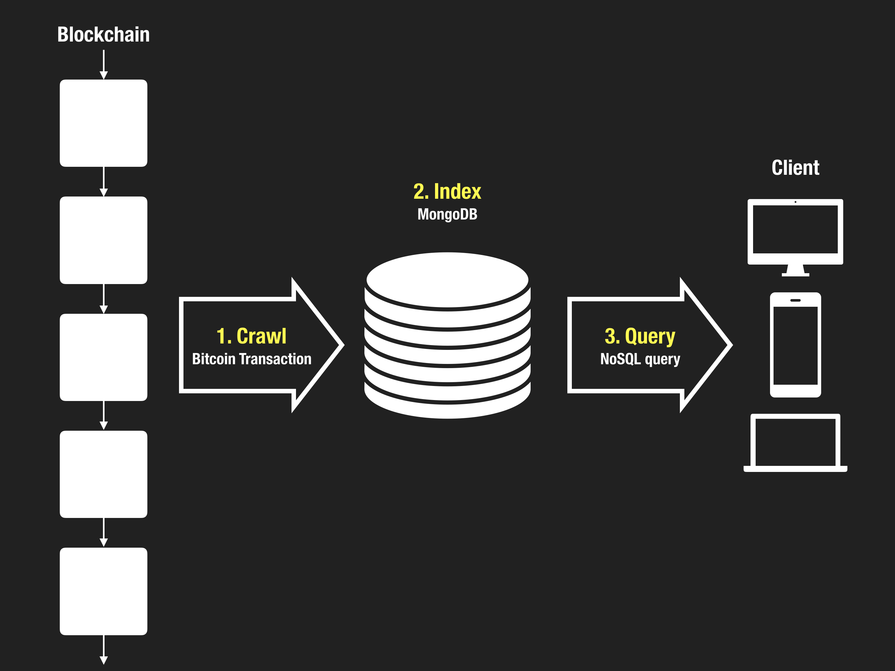

**Random Access Memory for Bitcoin**

[https://bitdb.network](https://bitdb.network)

<br>



<br>

> Bitcoin is the most secure hard disk that will ever exist. 
>
> BitDB is the memory that lets you make the most out of it.

---

## Hello BitDB

Before diving in, here are some useful links that may be helpful in your journey with BitDB:

> **Twitter:** Follow [@_unwriter](https://twitter.com/_unwriter) on Twitter for bitdb related announcements
>
>**Github:** [BitDB Github Repository](https://github.com/21centurymotorcompany). BitDB is 100% open sourced.
>
>**Telegram:** Have questions? [Join the chat](https://t.me/joinchat/HH1DDQ8pZlSlsdNcKgIcxw) and meet other BitDB users and developers.

---

## What

### 1. Bitcoin-Driven Autonomous Database

BitDB is an autonomous database that continuously synchronizes itself with Bitcoin, providing a flexible, fast, powerful, and portable query interface into the Bitcoin universe, in realtime.

By **functioning as a "Memory" to Bitcoin's "Hard Disk"**, BitDB enables a whole new category of powerful in-memory data processing that used to be impossible with Bitcoin's JSON-RPC alone, and makes it as simple as a MongoDB query.



### 2. BitDB is Readonly

Humans can't directly write to BitDB. The only "user" with "write" permission to BitDB is **Bitcoin** itself.

BitDB utilizes Bitcoin as the single source of truth and doesn't require any human intervention once it starts running as an autonomous daemon because it's a self-contained crawler + parser + indexer + query engine, all in one. 


With this approach, the "database" is merely an index built from the canonical Bitcoin blockchain, just like how web search engines are merely indexes built from websites they crawl and the "source of truth" is always the original website.

### 3. Writing to Bitcoin

So if Bitcoin is the only entity that can write to BitDB, how can a lowly human being write to BitDB then?

Simple, you go directly to the source (Bitcoin) and write to it. And how do you write to Bitcoin? Make a Bitcoin transaction!

You'll see that BitDB immediately synchronizes with Bitcoin and your transaction shows up on BitDB instantly. Here are some libraries that provide various flexible ways to WRITE to Bitcoin:

<div class='well'>

#### i. BitBox SDK

https://developer.bitcoin.com/bitbox.html


---

#### ii. Bitcoincash.js

https://bitcoincashjs.github.io/


</div>

### 4. BitDB is Bitcoin

In essence, BitDB is a database constructed by a one-way synchronization function that transforms a raw Bitcoin transaction into a structured data format that can be queried against.



This means we can reconstruct identical BitDB databases as many times as we want from Bitcoin. If there's a nuclear war and every single BitDB node goes down, as long as there are Bitcoin nodes running, you can recover from the destruction by traversing the transform function through time (blockchain).

- Because BitDB is backed by Bitcoin as canonical storage, it comes with all the benefits of Bitcoin's decentralization (Anyone can reconstruct and run a BitDB node from scratch as long as they have a Bitcoin node)

- Because BitDB is powered by MongoDB as index, it comes with all the benefits of NoSQL databases, such as highly flexible and portable query interface and better user experience.

So what kinds of problems does BitDB solve exactly? Let's take a look.

---

## Why

### 1. Problem Example

Bitcoin's transaction inputs and outputs are encoded in a low level language called "script" which looks like this:

```
OP_DUP OP_HASH160 20 0x3e2288390ab7a25cad792e662431db4bda0b9c6b OP_EQUALVERIFY OP_CHECKSIG
```

Bitcoin validates this transaction by walking through this script from left to right, pushing and popping and computing each push data based on the opcodes and bitcoin script rules. While this is the simplest and most elegant way to implement programmable money, this elegance comes at a cost:

**Bitcoin script is not optimized for letting the "outside world" make sense of and take programmatic actions through powerful queries into Bitcoin.**

This means it's not easy to build user-facing applications directly on top of Bitcoin. For example, trying to find an answer to a problem like the following has been impossible:

```
Find all the transactions that were:
- Sent from the address qq4kp3w3yhhvy4gm4jgeza4vus8vpxgrwc90n8rhxe
- AFTER block 543210
- That contain an OP_RETURN output that contains the text "SLP"
```

This is just one example of what's not easily possible with Bitcoin today, but there are many more.

### 2. Three Types of Databases We Need

While we're at it, let's use our imagination and think of some hypothetical database systems for bitcoin that would be extremely useful to have in the future but don't exist yet:

1. **Bitcoin Transaction Database:** We need a powerful modern database interface for interacting with Bitcoin. Bitcoin's own JSON-RPC API provides some data but it's mostly limited to simple key-value queries about the chain state. It's not meant for massive queries that require huge memory consumption. It doesn't let us query into the entire universe of bitcoin transactions as a whole, and doesn't let us filter transactions using a powerful query language. What we need is an abstraction on top of Bitcoin which most bitcoin application developers don't even need to think about and use like a regular database to build their own decentralized apps.

2. **Bitcoin Script Database:** We need a database of every bitcoin script content from every transaction. This will let us build external applications that seamlessly parse, query, and interact with bitcoin scripts (both input scripts and output scripts) through powerful queries and even use the database to programmatically power real world actions.

3. **Bitcoin Graph Database:** We need a database that keeps track of the entire graph structure of all bitcoin transactions, such as which input is connected to which output, which address is connected to which input/outputs, etc. and allow for graph aggregation and traversal queries and analysis.

<br>

Good news: You don't have to wait because it's already here, it's called BitDB.

BitDB is all three of those databases in one:

- BitDB is a [Bitcoin Transaction Database](indexer#level-1-transaction)
- BitDB is a [Bitcoin Script Database](indexer#level-2-script)
- BitDB is a [Bitcoin Transaction Graph Database](indexer#level-3-graph)

---

## How

### 1. Solution Example

With BitDB, problems like:

```
Find all the transactions that were:
- Sent from the address qq4kp3w3yhhvy4gm4jgeza4vus8vpxgrwc90n8rhxe
- AFTER block 543210
- That contain an OP_RETURN output that contains the text "SLP"
```

can be solved with a single NoSQL query, as simple as:

```
{
  "q": {
    "find": {
      "in.e.a": "qq4kp3w3yhhvy4gm4jgeza4vus8vpxgrwc90n8rhxe",
      "blk.i": {
        "$gt": 543210
      },
      "$text": {
        "$search": "SLP"
      }
    }
  }
}
```

It's just a regular MongoDB query wrapped in a meta-query object "q":

- `"in.e.a"` stands for **input edge address**
- `"blk.i"` stands for **block index**

Since it's JSON, this query can even be sent over HTTP. BitDB nodes can provide HTTP API endpoints where various 3rd party decentralized applications can connect to for various purposes.

The standardized database query language protocol ensures that your app will live on forever even after you decide to move on from your project, because all that's required to run the application is the query.

### 2. Architecture Overview



Here's a high level overview of BitDB:

1. **Crawler:** BitDB crawls through every bitcoin transaction on the blockchain and turns bitcoin's 1-dimensional script into a 2-dimensional JSON object.
2. **Indexer:** The deserialized JSON object is stored and indexed in a NoSQL database.
3. **Query Engine:** Once the data is stored, it becomes trivial to make flexible queries such as filtering, aggregation, full text search, and graph queries

