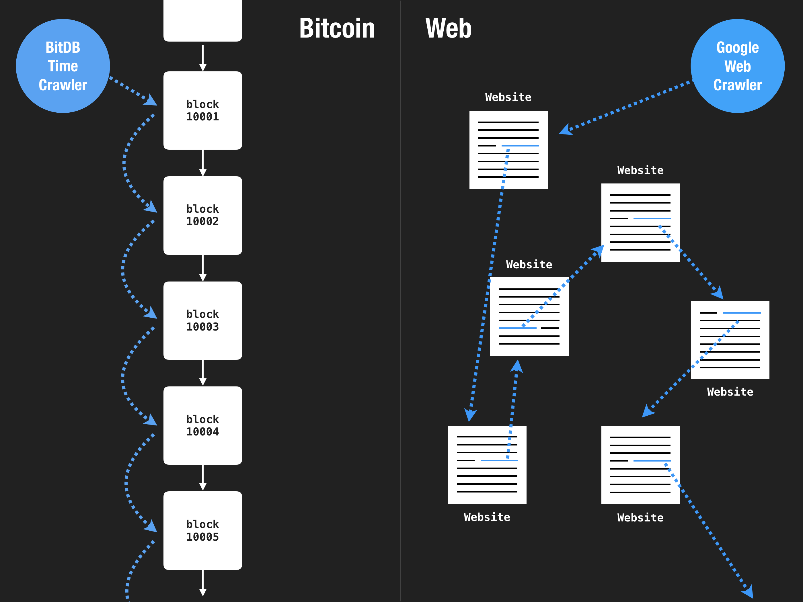

## Time Crawler

> A web search engine crawls links. 
>
> A bitcoin search engine crawls time.

Unlike web search engines like Google which crawl the web by traveling through a network of links, BitDB indexes bitcoin by traveling through time, linearly.

## Bitcoin Index

What does it mean to "crawl" and "index" bitcoin? Let's make a comparison to web search engines like Google.

1. Web Search Engines crawl the Web. BitDB crawls Bitcoin.
2. Web Search Engines crawl through links, BitDB crawls through time (blocks).
3. Web Search Engines index unstructured data (unstructured natural language content from websites) to create a search index. BitDB indexes structured data (Bitcoin Transactions) to create a knowledge index.
4. Web Search Engines are designed to be centralized and run as a single website. BitDB is designed to be decentralized and run as decentralized nodes.

### Web crawlers centralize

Because web search engines create their index by crawling these non-linear network of links, search engines are only as powerful as their ability to discover content on the web AND the ability to keep storing them.

Also, an index created this way is meant to be used by a single user-facing destination site, which means the search engines are destined to get into a war to attain user mindshare to their websites.

This is one of the reasons why most search engines have died off and we are left with very few, with a near monopolistic leader. All stems from the fact that the "index" is not a shared property.

### Bitcoin crawler decentralizes

It's a different story when it comes to Bitcoin.

First, BitDB on its own is not a user-facing product, it's a database engine that powers Bitcoin applications, and those applications are the user-facing products. BitDB is designed to be decentralized.

Second, every BitDB node is identical because it's deterministically derived from Bitcoin. It no longer matters who is running a "backend" at any given moment because you can always recover the data from the blockchain.

And as a result, developers are able to build portable applications that don't rely on a single server to run but are designed to run regardless of which BitDB instance it's using as a backend at any given moment. It's a whole new way of thinking about the concept of the "cloud".
