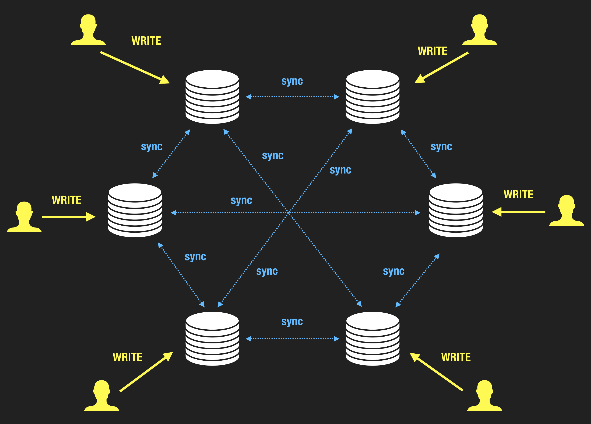
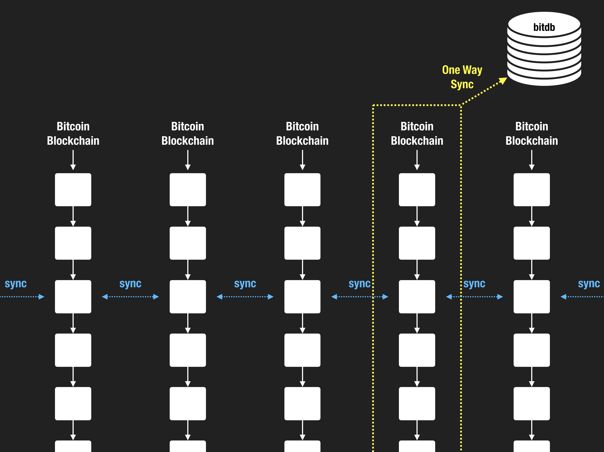

---

## "Decentralized Database"

Most attempts at building a "global decentralized database" have looked like this:

1. take an existing data storage solution that supports replication
2. implement the replication feature
3. sprinkle some magical distributed consensus and governance rules to tackle the decentralized replication problem.

The big challenge with this approach is that the network needs to not only get the tech but also the incentive structure right in order to achieve decentralization. If nobody is incentivized enough to run the network, the whole thing collapses overnight. This is not a trivial problem. There's a reason why we don't have a mainstream decentralized database with such architecture.

Bitdb does not invent a new experimental consensus algorithm, nor does it try to bootstrap a new network from scratch starting from 0 liquidity, all of which are huge risk factors for these initiatives.

Because Bitcoin has already solved the decentralized consensus problem through Proof of Work, Bitdb works right out of the box, because BitDB is Bitcoin.

---

## BitDB

One of the main reasons why these decentralized database or blockchains don't use proof of work is because they think that proof of work doesn't scale.

BitDB is a project to show that:

- It is not only possible to build a scalable decentralized app on top of proof of work
- But actually, proof of work is THE ONLY IDEAL way to build **truly decentralized** apps.

BitDB builds on top of Bitcoin.

### 1. BitDB is Proof of Work

Bitdb utilizes Bitcoin as the single source of truth, and the "database" is just a derived layer on top of the Bitcoin's blockchain, providing a high level, high throughput readonly API into Bitcoin.

BitDB can only be derived from Bitcoin (Only BitDB can write to itself by reading from Bitcoin, and humans can't write to BitDB directly) therefore the contents inside BitDB are transactions confirmed by Bitcoin's proof of work.

Application developers can also potentially apply additional measures to improve security, such as:

1. **Trust but verify:** Each BitDB document contains a transaction hash, so applications can cross-validate BitDB content directly with any available Bitcoin node.
2. **Multi-node cross-validation:** Cross-validate a BitDB document against multiple other BitDB nodes to check for discrepancies

### 2. BitDB is Readonly

One of the key distinctions with BitDB compared to all other "decentralized" projects is that BitDB does not try to reinvent what's already solved. It doesn't come up with a scheme to solve the problem of concurrent writes to the single source of truth, it only reads from it.

You can't directly write to BitDB. Only entity that can write to BitDB is itself, by auto-synchronizing with Bitcoin. So if you want to write to BitDB, you just need to make a Bitcoin transaction, and it will immediately synchronize.

This "readonly" and "one way synchronization" aspect is important because the act of writing is where all the convolution and complexity arises in other systems, and is exactly the problem Bitcoin has solved gracefully.

### 3. Conclusion

BitDB's read action is powered by flexible NoSQL database.

BitDB's write action is powered by Bitcoin's Proof of Work.

BitDB brings the efficiency of centralized databases while providing the security of Bitcoin's Proof of Work, by being one-way pegged to Bitcoin.
