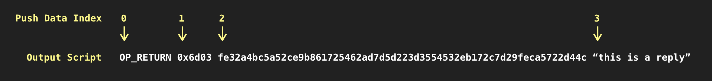

## Bitcoin 101

Here's a 30 second tutorial on Bitcoin.

1. Bitcoin is an **infinite graph of inter-linked transactions**, each transaction giving legitimacy to the next transaction it links to.
2. Transactions can link to one another through an interface called **"input"** and an **"output"**.
4. Transactions are constructed by linking its "input" with an "output" from an existing valid transaction.
5. This "linking" can only happen when **certain conditions are met**.
6. To express this "condition", these "inputs" and "outputs" **exist as a minimal programming language** called "Script".
7. "Script" is essentially **a one-dimensional list of instructions made up "push data"**, which can be either an opcode (command) or a value.
8. To run this program, bitcoin appends the "input script" to the "output script" it's trying to link to, and **evaluates the instructions while walking through it from left to right.**
9. When the **final evaluated result is true**, the two transactions are successfully "linked", and you have spent your bitcoin.

## BitDB 101

As discussed above, **bitcoin scripts are one-dimensional**. It works well for the program execution itself, but if we want to SEARCH for certain bitcoin script within the entire bitcoin universe (which is very useful in many cases), it's impossible because **bitcoin doesn't store them in a structured manner**.

This is why BitDB exists. **BitDB turns every Bitcoin transaction into a structured MongoDB document**.

For simplicity let's zoom into a specific example and take a look at how an OP_RETURN output is indexed in BitDB as an example:

> OP_RETURN is an opcode that lets you embed arbitrary data inside a bitcoin script without actually spending bitcoins. 



To interpret this we follow a simple rule:

```
Script output attribute names start with either "b", "s", or "h" followed by a number.

1. The prefix denotes the encoding scheme ("b" is base64, "s" is utf8, "h" is hex)
2. The number denotes the push data index
```

So let's interpret the above output script according to this rule (We will ignore the "h" attributes for now).

- Index 0: OP_RETURN
  - [The opcode of OP_RETURN is 106](https://en.bitcoin.it/wiki/Script#Opcodes). So we have `"b0": { "op": 106 }`
  - Since it's an opcode, there is no utf8 encoding version. So there is no `s0` attribute.
- Index 1: 0x6d03
  - This is hex encoded string of "6d02". When you transform it to base64, it becomes `{ "b1": "bQM=" }`
  - When you turn it into utf8, it's `{ "s1": "m" }`
- Index 2: fe32a4bc5a52ce9b861725462ad7d5d223d3554532eb172c7d29feca5722d44c
  - This is stored as UTF8, so `{ "s2": "fe32a4bc5a52ce9b861725462ad7d5d223d3554532eb172c7d29feca5722d44c" }`
  - The base64 version is `{ "b2": "ZmUzMmE0YmM1YTUyY2U5Yjg2MTcyNTQ2MmFkN2Q1ZDIyM2QzNTU0NTMyZWIxNzJjN2QyOWZlY2E1NzIyZDQ0Yw" }`
- Index 3: "this is a reply"
  - This is utf8, so `{ "s3": "this is a reply" }`
  - In base64, it's `{ "b3": "InRoaXMgaXMgYSByZXBseSI=" }`

Putting them all together:

```
{
  "out": [{
    "b0": { "op": 106 },
    "b1": "bQM=",
    "b2": "ZmUzMmE0YmM1YTUyY2U5Yjg2MTcyNTQ2MmFkN2Q1ZDIyM2QzNTU0NTMyZWIxNzJjN2QyOWZlY2E1NzIyZDQ0Yw==",
    "b3": "InRoaXMgaXMgYSByZXBseSI=",
    "s1": "m",
    "s2": "fe32a4bc5a52ce9b861725462ad7d5d223d3554532eb172c7d29feca5722d44c",
    "s3": "this is a reply"
  }]
}
```

So far we've covered how output scripts are stored. But it works the same way for input scripts. The only difference is these attributes are stored under an `"in"` array. 

Also there are other attributes aside from `"in"` and `"out"` in a single transaction object (Each BitDB document is a Bitcoin transaction) To put this in perspective, here's an example full BitDB document:

```
{
  "tx": {
    "h": "92b87fc7390dff0ccfc43469ce90a8d3dbc20e752fdd5cbde55a6d89e230cdf5"
  },
  "blk": {
    "i": 546492,
    "h": "000000000000000000d3ad1ddba37d2d82cd50246e8ed20ee4bbea235d066e25",
    "t": 1536117057
  },
  "in": [
    {
      "i": 0,
      "b0": "MEQCIBxgOSQVQJRcjGXz07oRbde3fqLKia+sM+9JqL+mba/vAiA1+Qb/waEmE8q37h7JRDZ09ZQDnAn85uWbTxeB4YCG+EE=",
      "b1": "A9bTZNMWZoIVSARHI/aosV9D5sfcXtzC/Dz3gxs+gQlc",
      "str": "<Script: 71 0x304402201c6039241540945c8c65f3d3ba116dd7b77ea2ca89afac33ef49a8bfa66dafef022035f906ffc1a12613cab7ee1ec9443674f594039c09fce6e59b4f1781e18086f841 33 0x03d6d364d31666821548044723f6a8b15f43e6c7dc5edcc2fc3cf7831b3e81095c>",
      "e": {
        "h": "269345a2bc54b716316b9e0b22b19b1ebdbf9467ee3cc87066ad97adbdcd8ab0",
        "i": 1,
        "a": "qqvmy646hp77rfws0562zter9adht3727yu7kf3sls"
      }
    }
  ],
  "out": [
    {
      "i": 0,
      "b0": {
        "op": 106
      },
      "b1": "bQI=",
      "s1": "m\u0002",
      "b2": "cG9zdCB0byBtZW1vLmNhc2gh",
      "s2": "post to memo.cash!",
      "str": "<Script: OP_RETURN 2 0x6d02 18 0x706f737420746f206d656d6f2e6361736821>",
      "e": {
        "v": 0,
        "i": 0
      }
    },
    {
      "i": 1,
      "b0": {
        "op": 118
      },
      "b1": {
        "op": 169
      },
      "b2": "GbJqurh94aXQfTShLyMvW3XHyvE=",
      "s2": "\u0019�j��}��}4�/#/[u���",
      "b3": {
        "op": 136
      },
      "b4": {
        "op": 172
      },
      "str": "<Script: OP_DUP OP_HASH160 20 0x19b26abab87de1a5d07d34a12f232f5b75c7caf1 OP_EQUALVERIFY OP_CHECKSIG>",
      "e": {
        "v": 16904,
        "i": 1,
        "a": "qqvmy646hp77rfws0562zter9adht3727yu7kf3sls"
      }
    }
  ]
}
```

Very quick overview:

1. tx: transaction info
2. blk: block info
    - blk.i: block index
    - blk.h: block hash
    - blk.t: block time
3. in: input array
4. out: output array

> This should be enough info to go on for now, but you can always look up the [indexer reference](indexer) to learn more about these attributes later.

One last thing, remember these `b0`, `b1`, ... and `s0`, `s1`, ... attributes are **subdocuments** under the `out` array, so you need to use `out.b0`, `out.s1`, etc. when querying since these are MongoDB queries.

Now go through the rest of the tutorial and try out all the queries to get a grasp of how queries work:

## Query Examples

The Bitquery query language contains [multiple attributes](query_v3#4-syntax). (Example: the `"v"` attribute refers to the query language protocol version, which is currently 3)

In this section we will take a look at some usage examples of the second attribute `"q"`.

This is the main part that contains the actual MongoDB query. [Learn more](query_v3#b-query)


### 1. Exact String Match

Find all transactions where the first push data is "hello" in UTF8 

[Try Query](https://bitdb.network/v3/explorer/ewogICJ2IjogMywKICAicSI6IHsKICAgICJmaW5kIjogeyAib3V0LnMxIjogImhlbGxvIiB9LAogICAgImxpbWl0IjogMTAKICB9Cn0=)

```
{
  "v": 3,
  "q": {
    "find": { "out.s1": "hello" },
    "limit": 10
  }
}
```

### 2. Hex-value Push Data Query

Another class of attribute you can query with is h0, h1, h2, ... which are hex encoded version of the push data.

Here's an example:

Find all transactions that start with "6d02" in hex as the first push data. 

[Try Query](https://bitdb.network/v3/explorer/ewogICJ2IjogMywKICAiZSI6IHsgIm91dC5iMSI6ICJoZXgiIH0sCiAgInEiOiB7CiAgICAiZmluZCI6IHsgIm91dC5iMSI6ICI2ZDAyIiB9LAogICAgImxpbWl0IjogMTAKICB9Cn0=)

```
{
  "v": 3,
  "q": {
    "find": { "out.h1": "6d02" },
    "limit": 10
  }
}
```

### 3. Exact Match + Full Text Search

Find all transactions where one of its outputs starts with "6d02" in hex, but also includes the string "bet" in any of its output push data. 

> Note:
>
> 1. You can use full text search on s-prefixed attributes.
> 2. Full text search is applied universally over all s-attributes so you can't search against a specific attribute

[Try Query](https://bitdb.network/v3/explorer/ewogICJ2IjogMywKICAiZSI6IHsgIm91dC5iMSI6ICJoZXgiIH0sCiAgInEiOiB7CiAgICAiZmluZCI6IHsKICAgICAgIiR0ZXh0IjogewogICAgICAgICIkc2VhcmNoIjogImJldCIKICAgICAgfSwKICAgICAgIm91dC5iMSI6ICI2ZDAyIgogICAgfSwKICAgICJsaW1pdCI6IDEwCiAgfQp9)

```
{
  "v": 3,
  "q": {
    "find": {
      "$text": { "$search": "bet" },
      "out.h1": "6d02"
    },
    "limit": 10
  }
}
```

### 4. Regular Expression + Full Text Search

It is possible to run regular expression matches on fields. But due to the way MongoDB works, running pure regular expression queries can be inefficient unless efficiently structured. ([Related Article](https://medium.com/statuscode/how-to-speed-up-mongodb-regex-queries-by-a-factor-of-up-to-10-73995435c606))

It is recommended that you use it in conjunction with a full text search to filter it down to a subset that matches the full text search results, and then apply the regex operation. (Also, make sure to read the linked article above)

Example: Find all transactions where the second push data matches the UTF8 regular expression `/hello.*/i` 

[Try Query](https://bitdb.network/v3/explorer/ewogICJ2IjogMywKICAicSI6IHsKICAgICJmaW5kIjogewogICAgICAiJHRleHQiOiB7CiAgICAgICAgIiRzZWFyY2giOiAiaGVsbG8iCiAgICAgIH0sCiAgICAgICJvdXQuczIiOiB7CiAgICAgICAgIiRyZWdleCI6ICJoZWxsby4qIiwgIiRvcHRpb25zIjogImkiCiAgICAgIH0KICAgIH0sCiAgICAibGltaXQiOiAxMAogIH0KfQ==)

```
{
  "v": 3,
  "q": {
    "find": {
      "$text": { "$search": "hello" },
      "out.s2": { "$regex": "hello.*", "$options": "i" }
    },
    "limit": 10
  }
}
```

### 5. Query by Address

Find all transactions sent from the address `qq4kp3w3yhhvy4gm4jgeza4vus8vpxgrwc90n8rhxe`

> The "in" array contains input scripts, which contain the graph structure named "e" (edge) that links each input to the previous transaction
> So if you want to query all transactions input edge address, you use "in.e.a" (input.edge.address)
> Learn more [here](https://docs.bitdb.network/docs/indexer#level-3-graph)

[Try Query](https://bitdb.network/v3/explorer/ewogICJ2IjogMywKICAicSI6IHsKICAgICJmaW5kIjogewogICAgICAiaW4uZS5hIjogInFxNGtwM3czeWhodnk0Z200amdlemE0dnVzOHZweGdyd2M5MG44cmh4ZSIKICAgIH0sCiAgICAibGltaXQiOiAxMAogIH0KfQ==)

```
{
  "v": 3,
  "q": {
    "find": {
      "in.e.a": "qq4kp3w3yhhvy4gm4jgeza4vus8vpxgrwc90n8rhxe"
    },
    "limit": 10
  }
}
```

### 6. Query by Multiple Addresses


Find all transactions sent from the address `qq4kp3w3yhhvy4gm4jgeza4vus8vpxgrwc90n8rhxe` and received by `qpne29ue8chsv9pxv653zxdhjn45umm4esyds75nx6`

[Try Query](https://bitdb.network/v3/explorer/ewogICJ2IjogMywKICAicSI6IHsKICAgICJmaW5kIjogewogICAgICAiaW4uZS5hIjogInFxNGtwM3czeWhodnk0Z200amdlemE0dnVzOHZweGdyd2M5MG44cmh4ZSIsCiAgICAgICJvdXQuZS5hIjogInFwbmUyOXVlOGNoc3Y5cHh2NjUzenhkaGpuNDV1bW00ZXN5ZHM3NW54NiIKICAgIH0sCiAgICAibGltaXQiOiAxMAogIH0KfQ==)


```
{
  "v": 3,
  "q": {
    "find": {
      "in.e.a": "qq4kp3w3yhhvy4gm4jgeza4vus8vpxgrwc90n8rhxe",
      "out.e.a": "qpne29ue8chsv9pxv653zxdhjn45umm4esyds75nx6"
    },
    "limit": 10
  }
}
```

### 7. Find OP_RETURN Transactions

Find all transactions that contain an **OP_RETURN** output (**output.b0** `{ op: 106 }`) 

[Try Query](https://bitdb.network/v3/explorer/ewogICJ2IjogMywKICAicSI6IHsKICAgICJmaW5kIjogewogICAgICAib3V0LmIwIjogewogICAgICAgICJvcCI6IDEwNgogICAgICB9CiAgICB9LAogICAgImxpbWl0IjogMTAKICB9Cn0=)

```
{
  "v": 3,
  "q": {
    "find": {
      "out.b0": { "op": 106 }
    },
    "limit": 10
  }
}
```

### 8. Find Multisig Transactions

Find all transactions that contain Multisig transactions (**output.b5** `{ op: 174 }`) 

[Try Query](https://bitdb.network/v3/explorer/ewogICJ2IjogMywKICAicSI6IHsKICAgICJmaW5kIjogewogICAgICAib3V0LmI1IjogewogICAgICAgICJvcCI6IDE3NAogICAgICB9CiAgICB9LAogICAgImxpbWl0IjogMTAKICB9Cn0=)

```
{
  "v": 3,
  "q": {
    "find": {
      "out.b5": { "op": 174 }
    },
    "limit": 10
  }
}
```

### 9. Filter down to the actual matched script

By default all queries return transaction objects since a "row" in BitDB is a transaction. However we can take advantage of the flexible MongoDB queries to drill down into the matched subdocuments.

For example, if we were looking for a specific match in an output, we can ask the query to return the actual matched output instead of the full transaction, using MongoDB's project and $ operator:

[Try Query](https://bitdb.network/v3/explorer/ewogICJ2IjogMywKICAiZSI6IHsgIm91dC5iMSI6ICJoZXgiIH0sCiAgInEiOiB7CiAgICAiZmluZCI6IHsgIm91dC5iMSI6ICI2ZDAyIiB9LAogICAgImxpbWl0IjogMTAsCiAgICAicHJvamVjdCI6IHsKICAgICAgIm91dC4kIjogMQogICAgfQogIH0KfQ==)

```
{
  "v": 3,
  "q": {
    "find": { "out.h1": "6d02" },
    "limit": 10,
    "project": { "out.$": 1 }
  }
}
```

---

## Processing Function Examples

This section is about the next attribute: "r" (response). Currently there's only one child to "r" named "f" (function), which is used for processing the DB response before returning to the client.

Bitquery uses a Turing complete data processing language that's very well fit for this purpose. It's called [jq](https://en.wikipedia.org/wiki/Jq_(programming_language)).

> Learn more about the processing fuiction in detail [here](https://docs.bitdb.network/docs/query_v3#c-processing)

In this section, pay attention to `.r.f` under every query.

### 1. Map

Here's a simple example for getting all "confirmed" posts (`"db": ["c"]`) from Memo.cash protocol and extracting out the `.blk.i`, `.blk.t`, and `.out[1].s2` attributes:

[Try Query](https://bitdb.network/v3/explorer/ewogICJ2IjogMywKICAicSI6IHsKICAgICJmaW5kIjogeyAib3V0LmgxIjogIjZkMDIiIH0KICB9LAogICJyIjogewogICAgImYiOiAiWyAuW10gfCB7IGJsb2NrOiAuYmxrLmk/LCB0aW1lc3RhbXA6IC5ibGsudD8sIGNvbnRlbnQ6IC5vdXRbMV0uczIgfV0iCiAgfQp9)

```
{
  "v": 3,
  "q": {
    "db": ["c"],
    "find": { "out.h1": "6d02" }
  },
  "r": {
    "f": "[ .[] | { block: .blk.i?, timestamp: .blk.t?, content: .out[1]?.s2 }]"
  }
}
```

### 2. Using Local Variables

Using the [variables operator](https://stedolan.github.io/jq/manual/#Advancedfeatures) in jq, we can assign values to local variables (`... as $identifier`) and use them later on in the expression.

In the example below, assign the `$blk` and `$tx` variables, and then use them later on in the last pipeline stage:

[Try Query](https://bitdb.network/v3/explorer/ewogICJ2IjogMywKICAicSI6IHsKICAgICJmaW5kIjogewogICAgICAiJHRleHQiOiB7ICIkc2VhcmNoIjogImJldCIgfSwKICAgICAgIm91dC5oMSI6ICI2ZDAyIgogICAgfSwKICAgICJsaW1pdCI6IDEwCiAgfSwKICAiciI6IHsKICAgICJmIjogIlsgLltdIHwgLmJsayBhcyAkYmxrIHwgLnR4IGFzICR0eCB8IC5vdXRbMV0gfCB7dW5peF90aW1lOiAkYmxrLnQsIGJsb2NrOiAkYmxrLmksIHR4OiAkdHguaCwgbXNnOiAuczJ9IF0iCiAgfQp9)

```
{
  "v": 3,
  "q": {
    "find": {
      "$text": { "$search": "bet" },
      "out.h1": "6d02"
    },
    "limit": 10
  },
  "r": {
    "f": "[ .[] | .blk as $blk | .tx as $tx | .out[1] | {unix_time: $blk.t, block: $blk.i, tx: $tx.h, msg: .s2} ]"
  }
}
```


### 3. String Interpolation

Using the [string interpolation](https://stedolan.github.io/jq/manual/#Stringinterpolation-\(foo)) feature, we can create a new string from existing attributes.

In the example below, we parse the SLP (Simple Ledger Protocol) Genesis transaction items and create a new string called `"title"` (as well as a normal attribute `document_url`):

[Try Query](https://bitdb.network/v3/explorer/ewogICJ2IjogMywKICAicSI6IHsKICAgICJmaW5kIjogeyAib3V0LmgxIjogIjUzNGM1MDAwIiwgIm91dC5zMyI6ICJHRU5FU0lTIiB9LAogICAgImxpbWl0IjogMjAsCiAgICAicHJvamVjdCI6IHsgIm91dC4kIjogMSwgIl9pZCI6IDAgfQogIH0sCiAgInIiOiB7CiAgICAiZiI6ICJbLltdIHwgLm91dFswXSB8IHt0aXRsZTogXCJbXFwoLnM0KV0gXFwoLnM1KVwiLCBkb2N1bWVudF91cmw6IC5zNn0gXSIKICB9Cn0=)

```
{
  "v": 3,
  "q": {
    "find": { "out.h1": "534c5000", "out.s3": "GENESIS" },
    "limit": 20,
    "project": { "out.$": 1, "_id": 0 }
  },
  "r": {
    "f": "[.[] | .out[0] | {title: \"[\\(.s4)] \\(.s5)\", document_url: .s6} ]"
  }
}
```

- it uses the `project` attribute to only return the matched output (the OP_RETURN one), through db-side filtering
- then it uses the response filter to extract out `s4` (token symbol), `s5` (token name) and `s6` (token url), but also makes use of the `\( )` operator for string interpolation.


### 4. String Construction

This makes a bitquery request, parses out the `s2` attributes from every output, and joins them to create a full HTML text.

[Try Query](https://bitdb.network/v3/explorer/ewogICJ2IjogMywKICAicSI6IHsgImZpbmQiOiB7ICJ0eC5oIjogImZhNjlmYjUzYmI0NWNkOWRmMzc1ZjkzZjZjY2E1MmQwNDRlNDUwNWVkYTVjZTFiOTUwNGFlMmM2YTk5OWFlMjciIH0sICJsaW1pdCI6IDEgfSwKICAiciI6IHsgImYiOiAiWy5bMF0ub3V0W10gfCAuczJdIHwgW3sgaHRtbDogam9pbihcIlwiKSB9XSIgfQp9)

```
{
  "v": 3,
  "q": { "find": { "tx.h": "fa69fb53bb45cd9df375f93f6cca52d044e4505eda5ce1b9504ae2c6a999ae27" }, "limit": 1 },
  "r": { "f": "[.[0].out[] | .s2] | [{ html: join(\"\") }]" }
}
```

### 5. Learn More 

There's much more you can do with jq, you can learn more about jq here:

- jq tutorial: [https://stedolan.github.io/jq/tutorial/](https://stedolan.github.io/jq/tutorial/)
- jq manual: [https://stedolan.github.io/jq/manual/](https://stedolan.github.io/jq/manual/)

---

