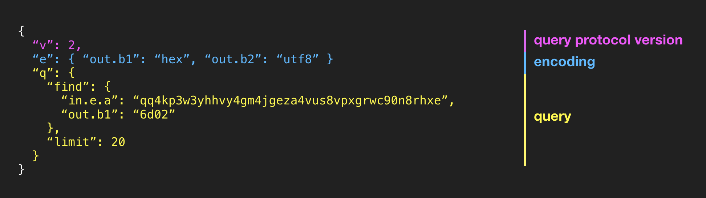

BitDB is powered by MongoDB.

On top of MongoDB's own query language, BitDB's query language adds one additional layer to create a completely self-contained and portable query language. The additional bitdb layer lets you express the query language protocol version, query encoding per push data, and the query itself.

- BitDB internally uses MongoDB to index the transactions in a structured manner. This means you can query it just like any regular MongoDB collection.
- BitDB supports most MongoDB methods such as find, aggregate, sort, limit, project, etc.
- To query the database, you simply make a request to BitDB with a JSON-based query language that looks like this:




## 1. BitDB Document Format

Before looking at the query language, first make sure you understand how a bitcoin transaction is decoded and transformed and stored into a query-optimized format in BitDB.

You can learn about BitDB document format in the Indexer section: [Learn Indexer](indexer)

## 2. BitDB Query Language

A BitDB query is a self-contained declarative JSON query object built on top of MongoDB query language. Every query consists of 3 top level attributes:

1. **v:** stands for "version". This documentation is based on v: 2 so always use v: 2 (v:1 has been deprecated)
2. **e:** stands for "encoding". Key-value pairs of encoding schemes for b-prefixed attributes used in the query request and its response. (example: `{ "e": { "out.b1": "hex" } }` means: "the **out.b1** attribute is hex encoded")
    - For requests, all **b-prefixed attributes** are treated as "utf8" if not specified
    - For responses, all **b-prefixed attributes** will be returned as base64 encoding unless you specify it here ("hex" or "utf8")
3. **q:** stands for "query".
    - **find:** MongoDB query filter object. Learn more about MongoDB query filter​
    - **aggregate:** MongoDB aggregationg pipeline stages array. Learn more about Mongodb aggregate stages​
    - **project:** MongoDB project operator for selectively returning attributes. Learn more about Mongodb projection​
    - **sort:** MongoDB sort operator. Learn more about Mongodb sort operator​
    - **limit:** MongoDB limit operator. Limit the number of results to return
    - **db:** The array of database types to query against. The default is ["confirmed", "unconfirmed"], but you can explicitly query against only one of them, using ["confirmed"], or ["unconfirmed"]

## 3. Example

> All examples below contain **"v": 2**, (version 2) you should also always include the version number ("v": 2 at the moment) in all your queries to future-proof your applications.

---

Find 10 OP_RETURN transactions that contains "hello" as the second push data:

1. The first push data (b0) is `{"op": 106}` (OP_RETURN)
2. The second push data in UTF encoding (s1) is "hello"

[Try Query](https://bitdb.network/v2/explorer/ewogICJ2IjogMiwKICAicSI6IHsKICAgICJmaW5kIjogewogICAgICAib3V0LmIwIjogewogICAgICAgICJvcCI6IDEwNgogICAgICB9LAogICAgICAib3V0LnMxIjogImhlbGxvIgogICAgfSwKICAgICJsaW1pdCI6IDEwCiAgfQp9)

```
{
  "v": 2,
  "q": {
    "find": {
      "out.b0": {
        "op": 106
      },
      "out.s1": "hello"
    },
    "limit": 10
  }
}
```

---

Find 10 transactions where the second push data is "6d02" in hex encoding

[Try Query](https://bitdb.network/v2/explorer/ewogICJ2IjogMiwKICAiZSI6IHsgIm91dC5iMSI6ICJoZXgiIH0sCiAgInEiOiB7CiAgICAiZmluZCI6IHsgIm91dC5iMSI6ICI2ZDAyIiB9LAogICAgImxpbWl0IjogMTAKICB9Cn0=)

```
{
  "v": 2,
  "e": { "out.b1": "hex" },
  "q": {
    "find": { "out.b1": "6d02" },
    "limit": 10
  }
}
```

---

Find 10 transactions where [the second push data is "00424554"](https://github.com/fyookball/ChainBet/blob/master/PROTOCOL.md#op_return-communication-messages)

[Try Query](https://bitdb.network/v2/explorer/ewogICJ2IjogMiwKICAiZSI6IHsgIm91dC5iMSI6ICJoZXgiIH0sCiAgInEiOiB7CiAgICAiZmluZCI6IHsKICAgICAgIm91dC5iMSI6ICIwMDQyNDU1NCIKICAgIH0sCiAgICAibGltaXQiOiAxMAogIH0KfQ==)


```
{
  "v": 2,
  "e": { "out.b1": "hex" },
  "q": {
    "find": {
      "out.b1": "00424554"
    },
    "limit": 10
  }
}
```

---

Find 10 transactions where the second push data is "6d02" in hex encoding, and the second push data matches "bet" in UTF8 (Note that it's combined with a full text search query for efficiency. Learn more about speeding up MongoDB regular expression queries here: [How to Speed-Up MongoDB Regex Queries by a Factor of up-to 10](https://medium.com/statuscode/how-to-speed-up-mongodb-regex-queries-by-a-factor-of-up-to-10-73995435c606))

[Try Query](https://bitdb.network/v2/explorer/ewogICJ2IjogMiwKICAiZSI6IHsgIm91dC5iMSI6ICJoZXgiIH0sCiAgInEiOiB7CiAgICAiZmluZCI6IHsKICAgICAgIiR0ZXh0IjogewogICAgICAgICIkc2VhcmNoIjogImJldCIKICAgICAgfSwKICAgICAgIm91dC5iMSI6ICI2ZDAyIiwKICAgICAgIm91dC5zMiI6IHsKICAgICAgICAiJHJlZ2V4IjogImJldCIsICIkb3B0aW9ucyI6ICJpIgogICAgICB9CiAgICB9LAogICAgImxpbWl0IjogMTAKICB9Cn0=)

```
{
  "v": 2,
  "e": { "out.b1": "hex" },
  "q": {
    "find": {
      "$text": {
        "$search": "bet"
      },
      "out.b1": "6d02",
      "out.s2": {
        "$regex": "bet", "$options": "i"
      }
    },
    "limit": 10
  }
}
```

---

Find 10 transactions with an input script with the sender `qq4kp3w3yhhvy4gm4jgeza4vus8vpxgrwc90n8rhxe`

[Try Query](https://bitdb.network/v2/explorer/ewogICJ2IjogMiwKICAicSI6IHsKICAgICJmaW5kIjogewogICAgICAiaW4uZS5hIjogInFxNGtwM3czeWhodnk0Z200amdlemE0dnVzOHZweGdyd2M5MG44cmh4ZSIKICAgIH0sCiAgICAibGltaXQiOiAxMAogIH0KfQ==)

```
{
  "v": 2,
  "q": {
    "find": {
      "in.e.a": "qq4kp3w3yhhvy4gm4jgeza4vus8vpxgrwc90n8rhxe"
    },
    "limit": 10
  }
}
```

---

## 4. Only Return the Matched Part

In many cases you are querying for a certain pattern in the subdocument.

For example, you may be looking for a transaction that matches certain OP_RETURN pattern in its output.

By default all BitDB queries return the entire transaction, so you may want to ask it to only return the matched OP_RETURN output. You can do this by using MongoDB's [Positional Operator $](https://docs.mongodb.com/manual/reference/operator/projection/positional/).

[Try Query](https://bitdb.network/v2/explorer/ewogICJ2IjogMiwKICAiZSI6IHsgIm91dC5iMSI6ICJoZXgiIH0sCiAgInEiOiB7CiAgICAiZmluZCI6IHsgIm91dC5iMSI6ICI2ZDAyIiB9LAogICAgImxpbWl0IjogMTAsCiAgICAicHJvamVjdCI6IHsKICAgICAgIm91dC4kIjogMQogICAgfQogIH0KfQ==)

```
{
  "v": 2,
  "e": { "out.b1": "hex" },
  "q": {
    "find": { "out.b1": "6d02" },
    "limit": 10,
    "project": {
      "out.$": 1
    }
  }
}
```
