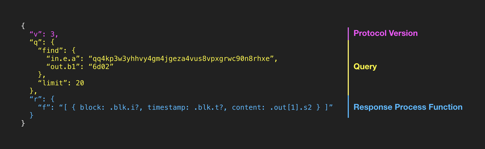

**A Turing Complete Query Language for Building Immutable APIs on Bitcoin**

<br>


---

## 1. Why

Bitquery is a query language implementation for [BitDB](https://bitdb.network), a universal bitcoin database.

Once the BitDB [crawler](https://docs.bitdb.network/docs/crawler) and [indexer](indexer) are up and running, you can query your BitDB node any way you want. It's just a MongoDB instance after all.

Because the **WRITE** (crawling + indexing) is deterministic (like a mathematical function), we can be sure that querying BitDB will be equivalent to querying Bitcoin.

However this is not enough. The main goals of BitDB are:

1. **Transparency:** BitDB should help applications build transparent and instantly open sourced applications
2. **Portability:** Applications powered by BitDB must be portable. If one host dies, the "spirit" (the application logic) should be able to seamlessly migrate over to another host.
3. **Interoperability:** Applications powered by BitDB should be able to talk to one another through open API mashups.
4. **Decentralization:** All these qualities should maximize decentralization factor so that no single party can have monopolistic power over the ecosystem.

To guarantee these qualities, BOTH **WRITE** AND **READ** must be deterministic, transparent, portable, and interoperable.

This is why BitDB has its own query language (and query engine).

It's called **Bitquery**.

## 2. What

Here's what a typical Bitquery looks like:



On top of **MongoDB's native query language**, Bitquery adds an additional layer to create a query language that's:

- **Programmable:** A Turing complete data processing language for filtering/manipulating the db response.
- **Self-contained:** Can describe every step of the query lifecycle. The query completely stands on its own without the need to depend on a 3rd party system or schema. 
- **Portable:** Written in JSON, the query can live anywhere since most existing programmable devices, OS, programming languages, and database systems support JSON natively.


## 3. BitDB Document Format

Before looking at the query language, first make sure you understand how a bitcoin transaction is decoded, transformed and stored into a query-optimized format in BitDB.

You can learn about BitDB document format in the [Indexer page](indexer)

## 4. Syntax

Bitquery is a self-contained declarative JSON query built on top of MongoDB query language. Every query consists of 3 top level attributes:

1. **v:** is for "version". This documentation is based on v: 3 so always use v: 3 (v:1 and 2 will be deprecated)
2. **q:** is for "query".
    - **find:** MongoDB query filter object. [Learn more about MongoDB find command](https://docs.mongodb.com/manual/reference/method/db.collection.find/)
    - **aggregate:** MongoDB aggregationg pipeline stages array. [Learn more about Mongodb aggregate stages](https://docs.mongodb.com/manual/reference/method/db.collection.aggregate/#db.collection.aggregate)
    - **project:** MongoDB project operator for selectively returning attributes. [Learn more about Mongodb projection](https://docs.mongodb.com/manual/tutorial/project-fields-from-query-results/)
    - **sort:** MongoDB sort operator. [Learn more about Mongodb sort operator](https://docs.mongodb.com/manual/reference/method/cursor.sort/)
    - **limit:** MongoDB limit operator. Limit the number of results to return. [Leanr more about MongoDB limit operator](https://docs.mongodb.com/manual/reference/method/cursor.limit/)
    - **skip:** MongoDB skip operator. Combining the "limit" and "skip" you can implement pagination. [Learn more about MongoDB skip operator](https://docs.mongodb.com/manual/reference/method/cursor.skip/)
    - **db:** The name of the database type  The default is ["c", "u"] (each representing "confirmed" and "unconfirmed" respectively), but you can explicitly query against only one of them, using ["c"], or ["u"]
3. **r:** is for "response". This is the response processor.
    - **f:** is for "function". It's a single-line program for processing the DB response before sending back to the client. The supported language is [jq](https://en.wikipedia.org/wiki/Jq_(programming_language)), **a Turing complete, stack based JSON processing language.**


In the sections below, we will go through 3 important components of Bitquery:

1. **Encoding:** Abstract out all the messy encoding related challenges
2. **Query:** MongoDB based query language
3. **Processing:** Programmable response processing

---

### A. Encoding

Because every application can have their own custom encoding scheme per script push data, every BitDB query needs to contain the encoding info in addition to the query logic.

#### i. Quickstart

Just for getting started, you can skip the next section ("Under the Hood") and just understand the following attributes:

- b0, b1, b2, b3, b4, ... : use these to query the push data in base64 encoding
- h0, h1, h2, h3, h4, ... : use these to query the push data in hex encoding
- s0, s1, s2, s3, s4, ... : use these to query the push data in UTF8 encoding (The s-attributes are also indexed for [full-text search](https://docs.mongodb.com/manual/reference/operator/query/text/))

Then check out the [BitDB Introduction](intro_v3#query-examples) to see some examples.

If you want to learn more about how these work behind the scenes, read on.

#### ii. Under the Hood

Because BitDB stores everything as base64 (b-attributes) and UTF8 (s-attributes) encoding, if we want to query with a hex encoded value, we need to manually specify that it's hex-encoded, so bitquery knows to transform it to base64 before making the query. 

We could use a designated object for describing the encoding scheme of each push data (this is how it used to work before version 3) but this results in a verbose query. There must be a simpler way of doing this.

In version 3, BitDB introduces a new concept called **"virtual attribute"** to make the query much simpler, flexible, and extensible. Here's how it works:

**Step 1. A client makes a query:** Here's an example v3 query. Notice the `out.h1`. This is the virtual attribute in question. It's used for expressing **hex encoded** values:

```
{
  "v": 3,
  "q": {
    "find": {
      "out.h1": "6d02"
    }
  }
}
```

**Step 2. Bitquery encodes the virtual attribute into base64:** Bitquery then replaces the hex key/value (`"out.h1": "6d02"`)into base64 counterpart (`"out.b1": "bQI="`). Above query is transformed at query time into:


```
{
  "v": 3,
  "q": {
    "find": {
      "out.b1": "bQI="
    }
  }
}
```

**Step 3. Bitquery sends the query to the DB:** The transformed query is then sent to MongoDB. And the DB returns a response that looks something like this:

```
{
  ...
  c: [{
    ...
    out: [{
      b0: {
        op: 106
      },
      b1: "bQI=",
      ...
    }]
    ...
  }]
  ...
}
```

**Step 4. Bitquery generates virtual attributes:** The query engine now decodes the b-attributes from above response to h-prefixed attributes and attaches them to the response. So the final response that's returned as the result is:

```
{
  ...
  c: [{
    ...
    out: [{
      b0: {
        op: 106
      },
      b1: "bQI=",
      h1: "6d02"
      ...
    }]
    ...
  }]
  ...
}
```

Now the response contains the "h1" attribute!

The client doesn't even need to know about all this. To the outside world it's almost as if the h-attributes are actually stored in the DB.

This approach can be extended to other types of attributes in the future in a scalable manner since all of this takes place in the code instead of the database.

To sum up:

1. BitDB introduces virtual variables with **h-prefix** (h0, h1, h2, h3, ...) which are hex encoded representations of the b0, b1, b2, b3, etc. counterparts.
2. These are "virtual" and not stored in the DB. They are generated at query time and response time.
3. This is powerful because it doesn't involve storing additional data, yet greatly enhances the expressive power of the language.
4. Using this simple trick, Bitquery may introduce additional virtual attributes in the future depending on the needs.

---


### B. Query

#### i. 1:1 Mapping to Native MongoDB query

The first step of Bitquery is the actual query.

1. You can declare the query under the `"q"` attribute of the query language.
2. Then the Bitquery engine translates this `"q"` object into a native MongoDB API call at runtime.

Here's an example:

```
{
  "v": 3,
  "q": {
    "find": {
      "$text": {
        "$search": "hello"
      },
      "out.h1": "6d02",
      "out.b2": "hello"
    },
    "skip": 5,
    "limit": 10,
    "sort": { "blk.i": 1 }
  }
}
```

The currently supported query API methods are: `find`, `aggregate`, `project`, `sort`, `limit`, and `skip`, but this can be extended according to demand.

To learn how to query BitDB, you can just think of this as a regular MongoDB instance.

- You can learn more about MongoDB queries [here](https://docs.mongodb.com/manual/tutorial/query-documents/)
- You can check out some example queries [here](quickstart_v3)

#### ii. Specifying the Database to Query against

There are currently two separate collections in BitDB: `c` (confirmed) and `u` (unconfirmed).

- `c`: "confirmed". Everything on the blockchain
- `u`: "unconfirmed". Everything in the mempool

By default, all queries are run against both `c` and `u` collections and returned as a unified object that looks like this:

```
{
  "u": [
    ...
  ],
  "c": [
    ...
  ]
}
```

However sometimes you may want to explicitly specify the database to query. You can use the `"db"` attribute, which can be:

- `["u"]`: unconfirmed only
- `["c"]`: confirmed only
- `["u", "c"]`: both unconfirmed and confirmed (default)

**Example 1.** Find all confirmed transactions in blocks with block height (block index) larger than 400000 (only query "confirmed" since "unconfirmed" doesn't have a block):

```
{
  "v": 3,
  "q": {
    "db": ["c"],
    "find": {
      "blk.i": { "$gt": 400000 }
    } 
  }
}
```

**Example 2.** Fetch all unconfirmed transactions in the mempool 


```
{
  "v": 3,
  "q": {
    "db": ["u"],
    "find": { } 
  }
}
```

### C. Processing

With version 3, Bitquery introduces an attribute called **"r"**, a response handler.

Currently there is only one type of response handler, named **"f"** (Response processing **function**). Here's an example (Pay attention to the **".r.f"** object):

```
{
  "v": 3,
  "q": {
    "find": { "out.h1": "534c5000", "out.s3": "GENESIS" },
    "limit": 20,
    "project": { "out.$": 1, "_id": 0 }
  },
  "r": {
    "f": "[.[] | .out[0] | { token_symbol: .s4, token_name: .s5, document_url: .s6} ]"
  }
}
```

Let's zoom in to the response processor function `r.f`:

```
"[.[] | .out[0] | { token_symbol: .s4, token_name: .s5, document_url: .s6} ]"
```

This is written in [jq](https://en.wikipedia.org/wiki/Jq_(programming_language)), a Turing complete data processing language. 


And here's how to read the program:

1. All jq programs are stack based, therefore you read from left to right
2. All jq programs assume an incoming input object and produces an output in the end
3. The `|` (pipe) works like [unix pipes](https://en.wikipedia.org/wiki/Pipeline_(Unix)). It passes the computed output from the left side as input to the right.

So following these rules (learn more about the syntax [here](https://stedolan.github.io/jq/manual/#Basicfilters)), here's what the code says:

1. for each item in the array (`.[]`)
2. find the first output (`.out[0]`)
3. and extract out its `.s4`, `.s5`, and `.s6` attributes to assign them to the custom attributes `"token_symbol"`, `"token_name"`, and `"document_url"`
4. and the entire expression is wrapped inside the root `[ ]`, which means it turns the resulting list into a JSON array

And here's the result:

```
{
  "u": [{
    ...
  }],
  "c": [{
    "token_symbol": "TEST",
    "token_name": "TEST",
    "document_url": "bitcoinfiles:b86b4bcbab7cd787b1c893ca101250c8c467dbba4df229b118218bd8a9e85a92"
  }, {
    "token_symbol": "VOTE",
    "token_name": "An Election",
    "document_url": "bitcoinfiles:a90e59ef7ca66b25b6ba98d028198ae222a8229804c4b0b3bc0b1bafe104738a"
  }, {
    "token_symbol": "WuCash",
    "token_name": "Wu Tang Cash",
    "document_url": "http://wu.cash"
  }, {
    "token_symbol": "bb23n",
    "token_name": "bb23",
    "document_url": "bb23n.com"
  }, {
    "token_symbol": "DBOOK01",
    "token_name": "Digital Book Example",
    "document_url": "https://digitalbookexampletokenurl.com"
  }, {
    "token_symbol": ""
    "token_name": ""
    "document_url": ""
  }, {
    "token_symbol": "MTT",
    "token_name": "MyTestToken",
    "document_url": ""
  }]
}
```

> Note: The processing function gets executed for each database the query is run against.
>
> This means "u" (unconfirmed) and "c" (confirmed) by default, but if you specify the db using the "q.db" attribute, the function will only be executed for that db collection

Notice how instead of returning all the raw non-human-readable `b-prefixed`, `h-prefixed`, or `s-prefixed` attributes straight from the DB, the API now returns the response in the **EXACT format you want**:

As you can see, this effectively closes the loop in the entire query lifecycle by letting you create a query that describes **NOT only the request, but also the response**, which means a query is completely self-contained for instant usage. 

> When we end up with a query language that is 100% self-contained for instant usage,
>
> It is no longer just a query.
>
> It is effectively an **Open API** (Application Programming Interface) for your application.

Let's go through the detailed benefits of this approach:

#### 1. Human Readable Response

The default `b-prefixed`, `h-prefixed`, or `s-prefixed` attribute names are NOT human processible--you have no idea what those attributes represent unless you look up the protocol specification.

You probably want a more human readable attribute name for the protocol API, such as "title", "document_uri", "username", etc.

#### 2. Turing Complete Query Language

The processing function is written in [jq](https://en.wikipedia.org/wiki/Jq_(programming_language)), a Turing complete, stack based functional programming language. Bitquery parser uses jq internally to process the response, so any syntax supported by jq is automatically possible inside the response processing function.

> [Learn jq syntax](https://stedolan.github.io/jq/manual/#Basicfilters)

Here are the benefits:

1. **Powerful:** jq is Turing complete, meaning you can transform any JSON into any format you want. Using the stack based paradigm, jq provides full range of programming capabilities such as: loops, map, filter, variable assignment, etc.
2. **Efficient:** It offloads the work from the database by doing all the filtering outside of the DB engine AFTER the DB responds, but BEFORE the result is sent back to the client. This makes the query much more performant.
3. **Portable:** Most importantly, the language fits into JSON format since jq is a single line programming language (stack based). 
4. **Programmable:** jq has been a popular language of choice for manipulating data in the command line interface. People use it along with other programs on their computer through the power of [unix piping](https://en.wikipedia.org/wiki/Pipeline_(Unix)), which makes it infinitely extensible and programmable. 

#### 3. Create Your Own API!

Now that it's possible to include the processing logic directly inside the query itself, you can make BitDB return a response in EXACTLY the format you want.

This means now you can use BitDB to **build your own API**.

Here's an example:

**"Find 100 transactions with an output OP_RETURN script that starts with `0x6d02` (memo.cash). And then return only its block index, block time, and content."**

```
{
  "v": 3,
  "q": {
    "find": { "out.h1": "6d02" },
    "limit": 100
  },
  "r": {
    "f": "[{ block: .blk.i?, timestamp: .blk.t?, content: .out[1].s2 }]"
  }
}
```


---

## 5. Programmability

Let's step back and think about how all this fit in together.

There are largely two important things happening here:

1. **DB Query:** A [query into bitcoin's state](#b-query) which always returns **deterministic results**.
2. **Process Function:** [A built-in functional programming language](#c-processing) that takes above result and **transforms** it into a completely new, yet **deterministic result**.

Since the **DB query** and the **processing function** are both embedded within a single query request, this single query effectively represents a new, **derived** piece of information from the blockchain in a **deterministic manner**.

To summarize, with a single JSON query, you can now:

1. Query the blockchain 
2. And pass the result to a transparent pure function
3. To produce a completely new dataset

This means we have just created a new piece of immutable data from bitcoin, through [alchemy](#c-processing)!


Because the original contents are immutable, and because the transform function is also immutable AND transparent (it's embedded in the query itself), by the law of transitivity, we can conclude that the resulting set of generated data is also immutable.

This simple addition will become especially powerful when multiple applications start adopting the common language and talk to one another.

---

## 6. Example

> All examples below contain **"v": 3**, (version 3) you should also always include the version number ("v": 3 at the moment) in all your queries to future-proof your applications.

### A. queries

---

Find 10 OP_RETURN transactions that contains "hello" as the second push data:

1. The first push data (b0) is `{"op": 106}` (OP_RETURN)
2. The second push data in UTF encoding (s1) is "hello"

[Try Query](https://bitdb.network/v3/explorer/ewogICJ2IjogMywKICAicSI6IHsKICAgICJmaW5kIjogewogICAgICAib3V0LmIwIjogeyAib3AiOiAxMDYgfSwKICAgICAgIm91dC5zMSI6ICJoZWxsbyIKICAgIH0sCiAgICAibGltaXQiOiAxMAogIH0KfQ==)

```
{
  "v": 3,
  "q": {
    "find": {
      "out.b0": { "op": 106 },
      "out.s1": "hello"
    },
    "limit": 10
  }
}
```

---

Find 10 transactions where the second push data is "6d02" in hex encoding

[Try Query](https://bitdb.network/v3/explorer/ewogICJ2IjogMywKICAicSI6IHsKICAgICJmaW5kIjogeyAib3V0LmgxIjogIjZkMDIiIH0sCiAgICAibGltaXQiOiAxMAogIH0KfQ==)

```
{
  "v": 3,
  "q": {
    "find": { "out.h1": "6d02" },
    "limit": 10
  }
}
```

---

Find 10 transactions where [the second push data is "00424554"](https://github.com/fyookball/ChainBet/blob/master/PROTOCOL.md#op_return-communication-messages)

[Try Query](https://bitdb.network/v3/explorer/ewogICJ2IjogMywKICAicSI6IHsKICAgICJmaW5kIjogeyAib3V0LmgxIjogIjAwNDI0NTU0IiB9LAogICAgImxpbWl0IjogMTAKICB9Cn0=)


```
{
  "v": 3,
  "q": {
    "find": { "out.h1": "00424554" },
    "limit": 10
  }
}
```

---

Find 10 transactions where the second push data is "6d02" in hex encoding, and the second push data matches "bet" in UTF8 (Note that it's combined with a full text search query for efficiency. Learn more about speeding up MongoDB regular expression queries here: [How to Speed-Up MongoDB Regex Queries by a Factor of up-to 10](https://medium.com/statuscode/how-to-speed-up-mongodb-regex-queries-by-a-factor-of-up-to-10-73995435c606))

[Try Query](https://bitdb.network/v3/explorer/ewogICJ2IjogMywKICAicSI6IHsKICAgICJmaW5kIjogewogICAgICAiJHRleHQiOiB7ICIkc2VhcmNoIjogImJldCIgfSwKICAgICAgIm91dC5oMSI6ICI2ZDAyIiwKICAgICAgIm91dC5zMiI6IHsgIiRyZWdleCI6ICJiZXQiLCAiJG9wdGlvbnMiOiAiaSIgfQogICAgfSwKICAgICJsaW1pdCI6IDEwCiAgfQp9)

```
{
  "v": 3,
  "q": {
    "find": {
      "$text": { "$search": "bet" },
      "out.h1": "6d02",
      "out.s2": { "$regex": "bet", "$options": "i" }
    },
    "limit": 10
  }
}
```

---

Find 10 transactions with an input script with the sender `qq4kp3w3yhhvy4gm4jgeza4vus8vpxgrwc90n8rhxe`

[Try Query](https://bitdb.network/v3/explorer/ewogICJ2IjogMywKICAicSI6IHsKICAgICJmaW5kIjogeyAiaW4uZS5hIjogInFxNGtwM3czeWhodnk0Z200amdlemE0dnVzOHZweGdyd2M5MG44cmh4ZSIgfSwKICAgICJsaW1pdCI6IDEwCiAgfQp9)

```
{
  "v": 3,
  "q": {
    "find": { "in.e.a": "qq4kp3w3yhhvy4gm4jgeza4vus8vpxgrwc90n8rhxe" },
    "limit": 10
  }
}
```

---

### B. response processing function

In addition to the `q` attribute, we have a response handler `r.f`. which uses a popular stack based JSON processing language called [jq](https://en.wikipedia.org/wiki/Jq_(programming_language)). Example:

Find 100 transactions with an output OP_RETURN script that starts with `0x6d02` (memo.cash). And then return only its block index, block time, and content.

```
{
  "v": 3,
  "q": {
    "find": { "out.h1": "6d02" },
    "limit": 100
  },
  "r": {
    "f": "[ { block: .blk.i?, timestamp: .blk.t?, content: .out[1].s2 } ]"
  }
}
```

More complex example:

1. Find 100 OP_RETURN transactions that start witn `0x6d02` (memo.cash)
2. Group by block index (blk.i)
3. Map the items to only return the message (.out[1].s2) and transaction hash (.tx.h)

```
{
  "v": 3,
  "q": {
    "db": ["c"],
    "find": { "out.h1": "6d02" },
    "limit": 100
  },
  "r": {
    "f": "[ group_by(.blk.h)[] | { blocks: { (.[0].blk.i | tostring): [.[] | {message: .out[1].s2, tx: .tx.h} ] } } ]"
  }
}
```


## 7. Misc.

### DB-side filtering

Another thing you can do to filter the query response is ask the database to do it. This can be done using MongoDB's `project`.

Unlike the `response filter` from the last section which takes place on the API server before responding to the client, the DB-side filtering actually takes place on the database engine therefore sometimes may be helpful (but not always)

> Caution: Adding too much stuff to the query via `aggregate`, etc. can put a large load on the server, so generally the response processing function is the recommended way to filter DB responses. (The response filter function is normally a better option)

However, simple `project` queries that don't construct a huge query are OK because it reduces the DB load.

#### A. 'project' reduces the DB load

'project' reduces the amount of data the database has to send back, even before it reaches the response filter. The smaller this size is the faster the query will be.

#### B. 'project' can return ONLY the matched subtree

For example, you may be looking for a transaction that matches a certain OP_RETURN pattern in its output.

By default all BitDB queries return the entire transaction, so you may want to ask it to only return the matched OP_RETURN output. You can do this by using MongoDB's [Positional Operator $](https://docs.mongodb.com/manual/reference/operator/projection/positional/).

[Try Query](https://bitdb.network/v3/explorer/ewogICJ2IjogMiwKICAiZSI6IHsgIm91dC5iMSI6ICJoZXgiIH0sCiAgInEiOiB7CiAgICAiZmluZCI6IHsgIm91dC5iMSI6ICI2ZDAyIiB9LAogICAgImxpbWl0IjogMTAsCiAgICAicHJvamVjdCI6IHsKICAgICAgIm91dC4kIjogMQogICAgfQogIH0KfQ==)

```
{
  "v": 3,
  "q": {
    "find": { "out.h1": "6d02" },
    "limit": 10,
    "project": { "out.$": 1 }
  }
}
```
