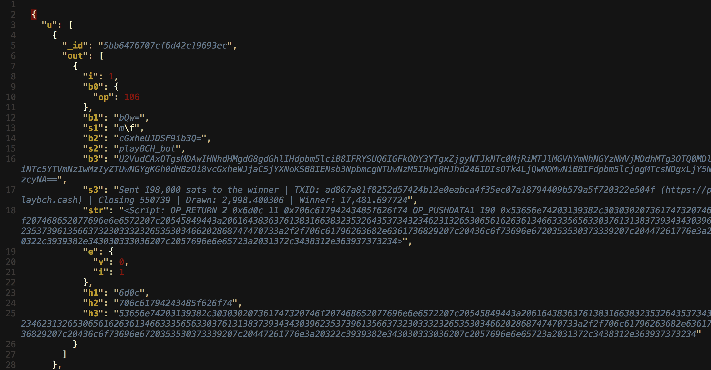

## Intro

Have you heard of BitDB? It's a universal bitcoin database that lets you easily build serverless decentralized applications on top of Bitcoin (If you haven't, check out [this article](https://www.yours.org/content/introducing-bitdb-20-e8c17c845939) to learn more)

If you've tried BitDB, you probably used the built-in JSON based query language.

While useful, this language was rough around thte edges, lacked some critical features, and I was far from satisfied with the expressive power and extensibility of the language. I've been internally experimenting and iterating on different approaches, and have finally reached a point where I can officially announce it (as well as give it a name).

Today I am releasing [Bitquery](https://docs.bitdb.network/docs/query_v3), **a Turing complete query language for building immutable APIs on Bitcoin**.

Also, I'm open sourcing [Bitqueryd](https://github.com/21centurymotorcompany/bitqueryd), the query engine that lets you interact with BitDB using bitquery language.


Note that while Bitquery is the default query language of BitDB, it's a completely decoupled from the [core bitd](https://github.com/21centurymotorcompany/bitd) module to maximize extensibility of each module going forward.

- **Bitd:** An autonomous engine that **writes** to BitDB

- **Bitqueryd:** A query engine that **reads** from BitDB through the bitquery query language.


## Quick Intro to BitDB

Before we discuss Bitquery, let's quickly go through what BitDB does:

1. It crawls Bitcoin
2. Parses raw transaction into a strucutred JSON document
3. Stores it into MongoDB


Here's what a raw transaction looks like:

```
0100000001b08acdbdad97ad6670c83cee6794bfbd1e9bb1220b9e6b3116b754bca2459326010000006a47304402201c6039241540945c8c65f3d3ba116dd7b77ea2ca89afac33ef49a8bfa66dafef022035f906ffc1a12613cab7ee1ec9443674f594039c09fce6e59b4f1781e18086f8412103d6d364d31666821548044723f6a8b15f43e6c7dc5edcc2fc3cf7831b3e81095cffffffff020000000000000000176a026d0212706f737420746f206d656d6f2e636173682108420000000000001976a91419b26abab87de1a5d07d34a12f232f5b75c7caf188ac00000000
```

BitDB transforms it into a structured object and stores it into database, like this:

```
{
  "tx": {
    "h": "92b87fc7390dff0ccfc43469ce90a8d3dbc20e752fdd5cbde55a6d89e230cdf5"
  },
  "blk": {
    "i": 546492,
    "h": "000000000000000000d3ad1ddba37d2d82cd50246e8ed20ee4bbea235d066e25",
    "t": 1536117057
  },
  "in": [
    {
      "i": 0,
      "b0": "MEQCIBxgOSQVQJRcjGXz07oRbde3fqLKia+sM+9JqL+mba/vAiA1+Qb/waEmE8q37h7JRDZ09ZQDnAn85uWbTxeB4YCG+EE=",
      "b1": "A9bTZNMWZoIVSARHI/aosV9D5sfcXtzC/Dz3gxs+gQlc",
      "str": "<Script: 71 0x304402201c6039241540945c8c65f3d3ba116dd7b77ea2ca89afac33ef49a8bfa66dafef022035f906ffc1a12613cab7ee1ec9443674f594039c09fce6e59b4f1781e18086f841 33 0x03d6d364d31666821548044723f6a8b15f43e6c7dc5edcc2fc3cf7831b3e81095c>",
      "e": {
        "h": "269345a2bc54b716316b9e0b22b19b1ebdbf9467ee3cc87066ad97adbdcd8ab0",
        "i": 1,
        "a": "qqvmy646hp77rfws0562zter9adht3727yu7kf3sls"
      }
    }
  ],
  "out": [
    {
      "i": 0,
      "b0": {
        "op": 106
      },
      "b1": "bQI=",
      "s1": "m\u0002",
      "b2": "cG9zdCB0byBtZW1vLmNhc2gh",
      "s2": "post to memo.cash!",
      "str": "<Script: OP_RETURN 2 0x6d02 18 0x706f737420746f206d656d6f2e6361736821>",
      "e": {
        "v": 0,
        "i": 0
      }
    },
    {
      "i": 1,
      "b0": {
        "op": 118
      },
      "b1": {
        "op": 169
      },
      "b2": "GbJqurh94aXQfTShLyMvW3XHyvE=",
      "s2": "\u0019�j��}��}4�/#/[u���",
      "b3": {
        "op": 136
      },
      "b4": {
        "op": 172
      },
      "str": "<Script: OP_DUP OP_HASH160 20 0x19b26abab87de1a5d07d34a12f232f5b75c7caf1 OP_EQUALVERIFY OP_CHECKSIG>",
      "e": {
        "v": 16904,
        "i": 1,
        "a": "qqvmy646hp77rfws0562zter9adht3727yu7kf3sls"
      }
    }
  ]
}
```

> You can learn more about what each attribute means [here](https://docs.bitdb.network/docs/indexer)

So how do we get the data OUT of BitDB?

One way would be to leave it up to app programmers to write their own custom code to handle **querying**, **encoding**, and **processing** the DB response to produce a human readable API. 

But this means every application will have a different way of reading from Bitcoin and will lead to interoperability issues and lack of decentralization.

**A better solution** is to design a high level declarative query language that takes care of all of this in a **portable** and **self-contained** manner, which is crucial in building truly decentralized applications on Bitcoin.

And THIS is Bitquery.


## Bitquery: Build Immutable APIs on Bitcoin

The most important part about Bitquery is that it lets you **build immutable, ownerless APIs on Bitcoin**.


### 1. Before

Let's take a look at an example raw BitDB object. The structure and the attribute names are not exactly "human readable":




### 2. After

On the other hand, here's what a Bitquery response looks like:


As you can see, **the query result is human readable, and INDISTINGUISHABLE from any mainstream API providers like Twitter, Facebook, etc..**.

So we get the best of both worlds--the usability of mainstream APIs, and the security of Bitcoin. This is possible because **Bitquery**:

1. not only lets you **Query Bitcoin through BitDB** (which is deterministically derived from Bitcoin)
2. but also lets you **Process the BitDB response with a Turing complete language**
3. all within a single query language, letting us create **"API endpoints"** that are containerized within a single portable JSON object.

So how does this Bitquery actually work?


## How Bitquery Works

Bitquery is a declarative query language that has the expressive power to contain all of the following within a single JSON object:

1. **Querying:** Query BitDB using the native JSON based query language for MongoDB.
2. **Encoding**: A built-in encoding scheme for dealing with bitcoin script push data.
3. **Processing:** Process the BitDB response using [jq](https://en.wikipedia.org/wiki/Jq_(programming_language)), a Turing complete stack based functional programming language.

Here's an example:


Let's go through each highlighted part:

1. **Protocol Version:** The query language is 100% self-contained (doesn't require a 3rd party schema to interpret its semantics) and will evolve over time, so it's important to declare the version.
2. **Query:** Bitquery implements a 1:1 mapping from the JSON query object to the native MongoDB query API. Basically it's a pure MongoDB query. (To see how BitDB stores these )
3. **Process Function:** This part is powered by [jq](https://en.wikipedia.org/wiki/Jq_(programming_language)), a Turing complete stack based functional programming language for processing data.


### 1. Querying

The query part is simple, it's just a mongodb query. Once you understand how each bitcoin transaction is indexed in BitDB, this part is as simple as making a regular mongodb query request.

So if you're looking for a transaction output that containst `OP_RETURN` as the first push data (index 0), you can write:

```
{
  "v": 3,
  "q": {
    "out.b0": { "op": 106 }
  }
}
```

> The opcode for OP_RETURN is 106


And to search for output scripts that are `OP_RETURN` and and contain the text "hello" in any of the push data, you can say:

```
{
  "v": 3,
  "q": {
    "$text": { "$search": "hello" },
    "out.b0": { "op": 106 }
  }
}
```

Again, it's just a regular MongoDB query. You can learn more here: 


### 2. Encoding

Another important part about Bitquery is its encoding handler.

Internally BitDB stores each script push data under "b0", "b1", "b2", ... as base64 encoded string (or as an object if it's an opcode) 

But each application protocol powered by bitcoin script can have their own custom encoding scheme per script push data. One app might be using **hex** encoding for the second push data, while another might be using **UTF8** encoding.

Therefore we need to specify the encoding of the attributes we're querying for. Bitquery makes this easy through the built-in attribute name convention:

- b0, b1, b2, b3, b4, ... : use these to query the push data in base64 encoding (or an opcode)
- h0, h1, h2, h3, h4, ... : use these to query the push data in hex encoding
- s0, s1, s2, s3, s4, ... : use these to query the push data in UTF8 encoding (The s-attributes are also indexed for [full-text search](https://docs.mongodb.com/manual/reference/operator/query/text/))

> In the earlier versions the query language included an extra object to describe these encoding schemes, but this was too verbose, not flexible enough, and not very intuitive.

For example, if you want to fetch Memo.cash posts whose output script looks like this:

```
OP_RETURN 0x6d02 Hello
```

You can write a query that looks like this:

```
{
  "v": 3,
  "q": {
    "out.b0": { "op": 106 },
    "out.h1": "6d02",
    "out.s2": "Hello"
  }
}
```

Here's what's going on:

1. **OP_RETURN**: It's index 0 push data, so the query looks for `out.b0` of `{"op": 106}` ([OP_RETURN's opcode is 106](https://en.bitcoin.it/wiki/Script#Opcodes)) 
2. **0x6d02**: It's index 1, and is hex format, so the query looks for `out.h1` of `"6d02"`
3. **Hello**: It's index 2, and is UTF8, so the query looks for `out.s2` of `"Hello"`


> You can learn more about the encoding scheme [here](https://docs.bitdb.network/docs/query_v3#a-encoding)


### 3. Processing

Finally, here's the last piece of the puzzle that's been missing from the previous versions of bitdb's query language--**programmability**.

With a raw query, BitDB only returns a regular transaction object--which as we saw above, is too raw and not human readable. And application developers probably will need to write additional code on their side to turn it into a usable format.

While this is certainly possible, the ideal approach would be if we could somehow pack even the processing part into the query language so everyone who wants to make use of an API endpoint can use exactly the same query, with as little additional code as possible.

To achieve this, Bitquery adopts [jq](https://en.wikipedia.org/wiki/Jq_(programming_language)), a popular **Turing complete functional programming language that fits into a single line string**.

jq was originally designed to be used in a unix command line setting, and this "command line" constraint gave rise to a programming language that is Turing complete yet can be packed into a single line string. And this quality is perfect for something like Bitquery.

For example, here's a bitquery that makes a query to BitDB (`"q.find"`), and then passes it to the response processing function (`r.f`) to extract out the `.blk.i`, `.blk.t`, `.out[1].s2` attributes and assign them to the human-readable attributes `block`, `timestamp`, and `content`, respectively:

```
{
  "v": 3,
  "q": {
    "find": { "out.h1": "6d02" }
  },
  "r": {
    "f": "[ .[] | { block: .blk.i?, timestamp: .blk.t?, content: .out[1].s2 }]"
  }
}
```

This is one example, but just remember, **jq is Turing complete**, which means you can process the query response to transform it into ANY format you desire.

And **THIS** is how you can create your own custom immutable API on Bitcoin.

You can write a query that results in a human readable response, and share it with any 3rd party developers who want to integrate with your application protocol.


## Example

Enough with the theory. Let's actually try something tangible.

Here's a quick example you can try out right now. Go ahead and copy and paste the code in a text editor, save it as an HTML file, and open it in a browser:

```
<html>
<script>
// Bitquery for filtering memo.cash posts (6d02) and extract out only the messages
var query = {
  "v": 3,
  "q": {
    "find": { "out.b0": { "op": 106 }, "out.h1": "6d02" },
    "project": { "out.$": 1 }
  },
  "r": {
    "f": "[ .[] | {msg: .out[0].s2} ]"
  }
};

// Make an HTTP request to bitdb.network public endpoint with an API key
fetch(
  "https://bitdb.network/q/" + btoa(JSON.stringify(query)),
  { "headers": { key: "qqjtyk2qmphm4d2ddqfeg855we2u4ly7m59a0tuenn" } }
).then(function(r) {
  return r.json()
}).then(function(r) {
  // Render the response!
  document.write("<pre>" + JSON.stringify(r, null, 2) + "</pre>")
})
</script>
</html>
```

The best part about bitdb is, **you can get started immediately without setting up some esoteric "developer environment"**.

If you want to be more secure, you can also add methods to cross-validate between multiple bitdb nodes, as well as cross-validate with any bitcoin node (Remember, bitdb is derived from bitcoin, so you can compare any bitcoin transaction with its corresponding bitdb document very easily)

Of course, the HTTP API is not the only way, there are two ways you can use bitdb:

1. **Direct:** Directly connect to the MongoDB instance through bitqueryd. This is simple if you run your own bitdb node.
2. **HTTP API:** Connect to a public BitDB node via HTTP API

In both cases you make the query request with exactly the same query object.


## Conclusion: What Does This All Mean?

### 1. Like a chain of math functions

Here's a high level view: We can think of the whole thing as a series of mathematical functions. 

1. **Index:** BitDB crawls, parses, and indexes Bitcoin's raw transaction in a structured manner. The whole process is deterministic, therefore we can be sure that querying BitDB is equivalent to querying Bitcoin. We can think of this as a "function" that takes the entire Bitcoin universe as input and returns the derived BitDB as output.
2. **Query:** The first step of Bitquery is the actual **query request** into the MongoDB instance. This could be seen as a "function" as well. It takes the **query object as "input"**, and returns the **response as "output"**.
3. **Process:** The second step of Bitquery is the **processing** part. This is where you can **manipulate the DB response into any format you want** using the transparent programming language (jq). This is also a "function" that takes the **BitDB query response as input** and returns **Application API as output**.


### 2. Build Immutable and Deterministic APIs

Because the entire derivation process (Bitcoin to BitDB to Bitquery to Application APIs) is completely open source, transparent, and has zero side-effect, we can conclude that **the resulting application api transitively benefits from the immutability and determinism of Bitcoin**, secured by Proof of Work.

At the same time, we end up with an API that can be so user-friendly and developer-friendly that it's indistinguishable from any existing mainstream cloud API providers.


### 3. API that can seamlessly talk to one another

Because we can trust that each API created this way is immutably derived from bitcoin, we can trust the resulting immutability and build one API on top of another. Multiple parties can build and publish their own APIs, and these APIs can communicate with one another.

Also, now that we have human-readable APIs, application developers can easily come up with an additional layer of open standards for such inter-application communications.

There are many more benefits and much more potential I haven't covered here, but I will leave it up to the reader's imagination.
