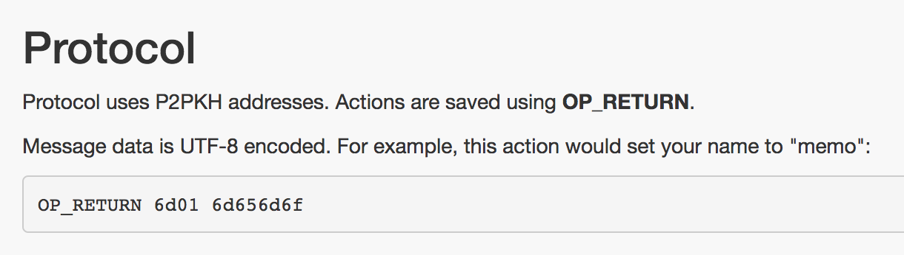
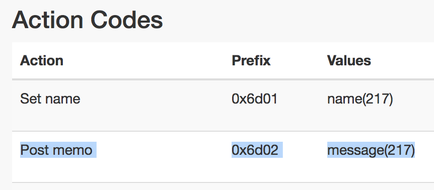

## Required Skills

> HTML and JavaScript. That's all!
>
> You don't even need to set up a server, this demo will run server-less, leveraging the bitdb.network public endpoint.

Let's build a bitcoin powered web app using a public BitDB Full Node at bitdb.network. 

The app will be 100% frontend (No server) and will fetch and display contents from [memo.cash](https://memo.cash) transactions from bitcoin through bitdb. The web app will look like this:

<br>


<br>

---


## Step 1. Get bitdb.network public node API key

[bitdb.network](https://bitdb.network) is a full node implementation of BitDB with a free HTTP API endpoint. The endpoint is completely free but you first need to sign up and get an API key (The API key is just for DDOS protection)

[[Get bitdb.network API Key]](https://bitdb.network/v3/dashboard)

<br>

---

## Step 2. Construct BitDB query

We are going to fetch bitcoin transactions that follow the [memo.cash OP_RETURN protocol](https://memo.cash/protocol). Check out the protocol spec and you'll find the following at the top:



This is just one example protocol, but most other OP_RETURN protocols work in similar ways. In this case there are 3 push data: `OP_RETURN`, `6d01`, and `6d656d6f`

BitDB turns this into a structured document and stores in the database.

Then through [Bitquery](query_v3) it lets you query the database easily, with attributes like.

- **out.b0**: `{ "op": 106 }` (OP_RETURN's code is 106)
- **out.b1**: base64 encoded version of 0x6d01
- **out.b2**: base64 encoded version of 0x6d656d6f

> To learn more about the Bitdb document format, see [here](indexer#2-bitdb-document-format)

Now that we understand how Memo's protocol works, let's look at the actual "action" that we're interested in. We only want to fetch all the "Post memo" actions and display them.



So what we need is:

- An OP_RETURN output ( {"op": 106} ) at index 0 (`out.b0`)
- that has 6d02 at index 1 (`out.h1` -- we use the "h1" attribute since we're querying for hex format)
- and process the response to extract out the push data at index 2 (`out.s2`) to create a custom API (assign `s2` to a human readable attribute)
- Then use the custom API response to render the HTML

Here's an example of what a real-world memo.cash "Post memo" transaction output looks like:

```
{
  ...
  "out": [{
    ...
  }, {
    "i": 1,
    "b0": {
      "op": 106
    },
    "b1": "bQI=",
    "s1": "m\u0002",
    "h1": "6d02",
    "b2": "SGVsbG8gZ29vZCBqb2Igb25saW5lIHdvcmtpbmcKaHR0cDovL3JlZGQuaXQvOWhmZ2xl",
    "s2": "Hello good job online working\nhttp://redd.it/9hfgle",
    "h2": "48656c6c6f20676f6f64206a6f62206f6e6c696e6520776f726b696e670a687474703a2f2f726564642e69742f396866676c65",
    "str": "<Script: OP_RETURN 2 0x6d02 51 0x48656c6c6f20676f6f64206a6f62206f6e6c696e6520776f726b696e670a687474703a2f2f726564642e69742f396866676c65>",
    "e": {
      "v": 0,
      "i": 1
    }
  }]
}
```

The query to filter out above pattern looks like this:


```
var query = {
  "v": 3,
  "q": {
    "find": { "out.b0": { "op": 106 }, "out.h1": "6d02" },
    "project": { "out.$": 1 }
  },
  "r": {
    "f": "[ .[] | {msg: .out[0].s2} ]"
  }
}
```

1. **v:** 2. we're using API version 3 and must specify this in the query protocol.
2. **q:** Inside the q is just a regular MongoDB query.
    - **find:** It's looking for a match for "out.h1": "6d02" ('h'-prefixed variables are used for hex-encoded queries)
    - **project:** This is a special MongoDB projection operation that [only returns a matched subdocument instead of the entire document](query_v3#4-only-return-the-matched-part). In this case, our query will match with a transaction's output, and without this clause it will return the entire transaction. We only want it to return the OP_RETURN output that matched, which is why we've added this line.
3. **r:** the `r.f` is a [jq](https://stedolan.github.io/jq/) expression that transforms the query result into another format. This is the part that lets you build your own custom API from Bitquery. In this case, it's taking the query response and extracting out its `s2` attribute (and assigning to a custom variable "msg") to create the final result.


---

## Step 3. Write the Web App

Now that we've constructed the query, we just need to make an HTTP request to a bitdb node and render its results (Remember to replace the **[[YOUR API KEY GOES HERE]]** part with your own API key from step 1)

```
<html>
<head>
<style>
body {
  padding: 50px;
  font-family: arial;
  font-size: 12px;
}
div {
  width: 500px;
  margin: 0 auto;
  padding: 10px 0;
}
</style>
<script>

// The query we constructed from step 2.
var query = {
  "v": 3,
  "q": {
    "find": { "out.b0": { "op": 106 }, "out.h1": "6d02" },
    "project": { "out.$": 1 }
  },
  "r": {
    "f": "[ .[] | {msg: .out[0].s2} ]"
  }
}

// Turn the query into base64 encoded string.
// This is required for accessing a public bitdb node
var b64 = btoa(JSON.stringify(query));
var url = "https://bitdb.network/q/" + b64;

// Attach API KEY as header
var header = {
  headers: { key: [[YOUR API KEY GOES HERE]] }
};

// Make an HTTP request to bitdb.network public endpoint
fetch(url, header).then(function(r) {
  return r.json()
}).then(function(r) {
  // "r.c" stands for confirmed transactions response array
  // Parse the response and render the results on the screen
  r.c.forEach(function(output) {
    var div = document.createElement("div");
    div.innerHTML = output.msg;
    document.body.appendChild(div)
  })
})
</script>
</head>
<body>
</body>
</html>
```

And that's it! Open the HTML file in your browser and you should see the following screen, with the latest content from Memo.cash:

<br>


